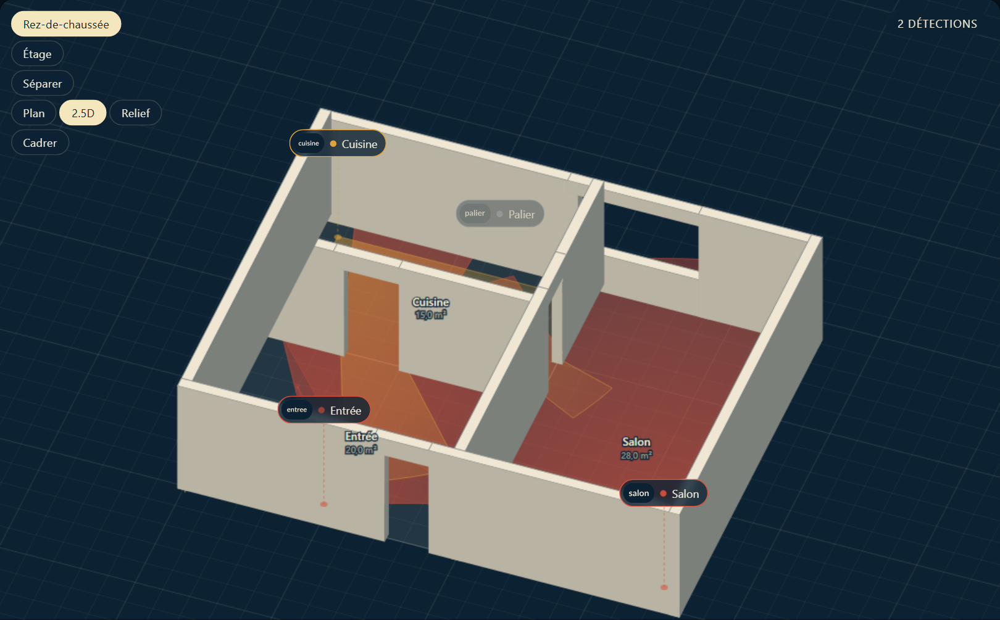
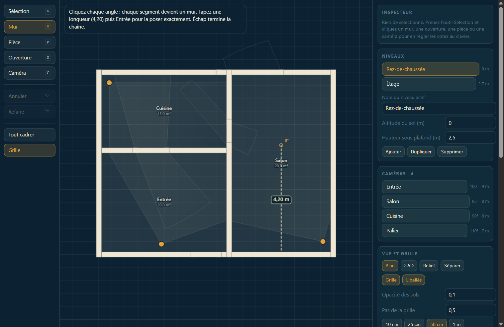

# Sémaphore

Une carte Home Assistant qui dessine **le plan de votre maison en 2.5D** — murs,
pièces, portes — et y projette la couverture réelle de vos caméras Frigate.

Pas de fond de carte. Pas de compte à créer. Tout se dessine à la souris, en
mètres, sur une grille.



> **Dessinez votre maison hors de Home Assistant.**
> `npm run dev` ouvre un **éditeur de plan autonome**, plein écran, sans compte
> ni serveur : vous tracez les murs, posez les caméras, puis vous exportez un
> bloc YAML que vous collez dans votre carte. Voir
> [L'éditeur autonome](#léditeur-autonome).

---

## Le parti pris

**Une caméra est un feu à secteurs.** Sur une carte marine, la couverture d'un
phare se dessine comme un secteur angulaire coloré : blanc quand la passe est
libre, rouge et vert quand elle ne l'est pas. Un champ de vision est le même
objet. Reprendre la convention donne une palette qui *porte de l'information* au
lieu de décorer.

D'où le nom : un sémaphore est une station de guet côtière.

| Couleur | Rôle |
|---|---|
| `#F4E7BE` blanc de secteur | veille, rien à signaler |
| `#E2A23A` jaune de balise | mouvement non classifié |
| `#D9503C` rouge de secteur | objet détecté |
| `#2F9E6B` vert de secteur | flux dégradé |
| `#5B7285` ardoise | hors ligne |

---

## Les quatre décisions structurantes

### 1. Un mur est décrit une fois et servi deux fois

Chaque mur est extrudé en faces pour l'image **et** aplati en segments pour le
lancer de rayons. Une porte se soustrait des deux dans la même passe. Il n'y a
donc pas deux géométries qui pourraient diverger : si vous redressez un mur, le
cône qu'il bloque se recalcule dans le même geste.

Conséquence directe : **une caméra voit à travers une porte ouverte**, parce que
l'ouverture est un trou dans la ligne de vue autant que dans la maçonnerie. Une
ouverture peut être marquée opaque si ce n'est pas ce que vous voulez.

### 2. Les pièces ne portent pas les murs

Une pièce est une dalle, un nom et une surface. Tout ce qui bloque la vue vit
dans les murs. C'est ce qui permet un mur isolé, une cloison qui s'arrête au
milieu d'une pièce, une haie, un muret de terrasse — des choses qui n'enferment
rien et qu'un modèle « pièce = contour fermé » ne sait pas exprimer.

### 3. La projection est orthographique, pas en perspective

Une perspective est plus jolie sur une capture d'écran et hostile au dessin :
les parallèles convergent, la grille change de pas selon l'endroit, et retrouver
le point du monde sous le curseur demande un lancer de rayon.

En orthographique, un mètre fait le même nombre de pixels partout, la grille
reste une grille, et l'inverse écran → monde est une forme close exacte. On
clique un point, on obtient ce point. Le pitch 0 donne un plan à plat pour
tracer ; le pitch 45 donne la lecture 2.5D. C'est la même caméra, sans
changement de mode.

**Le lacet compte autant que l'inclinaison.** Regarder droit dans l'axe +y met
tous les murs est-ouest exactement de profil : une maison rectangulaire inclinée
à 45° s'aplatit alors en élévation, la hauteur est dessinée et rigoureusement
invisible. Un quart de tour hors axe montre deux faces de chaque angle, et le
volume se lit d'un coup d'œil. D'où trois **préréglages de vue** — Plan (0°,
dans l'axe), 2.5D (45°, 20° de lacet), Relief (62°, 32°) — plutôt qu'un simple
réglage d'inclinaison.

### 4. Canvas 2D, pas WebGL

Une maison fait quelques centaines de polygones. Le GPU n'apportait rien et
coûtait le texte net, le hit-testing simple, et 310 kB de MapLibre. Le bundle
complet fait **33 kB gzip**, sans autre dépendance que Lit.

L'éditeur n'en fait pas partie. Une carte de tableau de bord qui embarque aussi
un outil de dessin fait payer à chaque chargement, à tout le monde, un outil
qu'on ouvre deux fois dans sa vie. La carte affiche une scène et la fait
tourner ; le plan se dessine ailleurs.

---

## L'éditeur autonome

```bash
npm install
npm run dev          # http://localhost:5173/
```

Une application de bureau dans le navigateur : **aucune clé, aucun compte, aucun
Home Assistant**. C'est le même éditeur et le même moteur de rendu que dans la
carte — ce que vous voyez à l'écran est ce que la carte dessinera — mais avec la
fenêtre entière, un document à lui, et un export qui produit une configuration
complète.

Le cycle tient en trois gestes :

1. **Tracer.** Murs, pièces, portes, caméras, sur une grille en mètres.
2. **Exporter.** Le bouton *Exporter le YAML* donne le bloc entier, ligne
   `type:` comprise. Copier, ou télécharger un `.yaml`.
3. **Coller** dans Home Assistant : *Modifier le tableau de bord* → *Ajouter une
   carte* → *Manuel*.

Et retour : **Importer…** relit la configuration que vous avez déjà dans Home
Assistant — collée, ou déposée en glissant un fichier sur la page — y compris
depuis une pile de cartes. Un YAML fautif est refusé **en nommant la ligne**,
sans toucher au plan à l'écran.

Ce que l'éditeur ajoute, au-delà du tracé lui-même :

- **Gestion des niveaux** : ajouter, dupliquer (tous les identifiants
  régénérés), supprimer, régler altitude et hauteur sous plafond. **Séparer**
  écarte les étages pour les voir tous à la fois.
- **Options de la carte** : préfixe MQTT, fenêtre de timeline, décroissance,
  étiquettes d'alerte, format des box — dans des champs plutôt qu'à la main.
- **Contrôles permanents** : ce qui empêchera la carte de charger, et ce qui la
  laissera charger sans rien faire d'utile — une caméra sans calibration, des
  pièces sans murs, une ouverture qui déborde de son mur.
- **Apparence** : grille et libellés de pièce à afficher ou non, densité des
  dalles, couleur du sol de chaque pièce et couleur de secteur de chaque caméra.
  Tout part dans le YAML, donc la carte rend ce que l'éditeur montrait.
- **Couverture réelle** d'une caméra sélectionnée, en pourcentage du secteur
  théorique : 30 % veut dire qu'elle regarde surtout un mur.
- **Enregistrement automatique** dans le navigateur : un rechargement ne perd
  rien.

**Tout le dessin est ici.** La carte n'a plus de mode édition : elle affiche une
scène et la fait tourner, rien d'autre.

| Outil | Raccourci | Geste |
|---|---|---|
| Sélection | `G` | tirer un sommet, un mur, une caméra. Suppr efface |
| Mur | `M` | cliquer chaque angle ; chaque segment devient un mur |
| Pièce | `P` | cliquer le contour, double-clic ou Entrée pour fermer |
| Ouverture | `O` | cliquer sur un mur pour y percer une porte |
| Caméra | `C` | cliquer l'emplacement, puis tirer les poignées |

**Ce qui rend le tracé praticable :**

- **Accrochage hiérarchisé** : un sommet existant l'emporte sur une arête de
  mur, qui l'emporte sur le verrou d'angle, qui l'emporte sur la grille. Le plus
  spécifique que vous pouviez vouloir gagne. `Maj` libère tout.
- **Verrou d'angle** à 15°, avec une tolérance exprimée en pixels et non en
  degrés — sinon le verrou est inéchappable près du point de départ et inutile
  à trois mètres.
- **Cote en direct** pendant le tracé, et **saisie au clavier** : tapez `4.2`
  puis Entrée et le mur fait exactement 4,20 m, dans la direction que vise le
  curseur.
- **Annuler / refaire** (`Ctrl+Z` / `Ctrl+Y`), un geste = une annulation.
- **Grille réglable** : 10, 25, 50 cm ou 1 m.
- **Inspecteur numérique** : longueur, épaisseur, hauteur d'un mur ; largeur,
  allège, linteau et type d'une ouverture ; cap, ouverture, portée d'une caméra.
- **Murs autour** : entoure une pièce tracée de ses quatre murs en un clic.



Navigation : molette pour zoomer, clic droit glissé pour pivoter et incliner,
`Alt` ou clic milieu pour déplacer.

Si le presse-papier n'est pas disponible — page servie en HTTP simple, où l'API
n'existe pas — le bloc reste affiché pour sélection manuelle, et le bouton
**Télécharger .yaml** ne dépend de rien.

---

## Ce que la 2.5D montre

La scène se manipule directement, sans entrer dans aucun mode :

| Geste | Effet |
|---|---|
| glisser | faire pivoter et incliner |
| molette · pincement à deux doigts | zoomer |
| deux doigts qui glissent · `Alt`, `Maj`, clic droit ou milieu | déplacer |

Et le rail porte trois préréglages — **Plan**, **2.5D**, **Relief**. Ils changent
l'inclinaison *et* le lacet ensemble, parce que l'un sans l'autre ne donne pas de
volume (voir la décision 3). Dès que vous tournez la scène à la main, plus aucun
préréglage ne s'affiche comme actif : aucun ne décrit l'angle que vous avez
trouvé.

Une fois inclinée, la scène dit trois choses qu'un plan ne peut pas dire :

- **La hauteur des murs.** Chaque tronçon plein est extrudé en boîte, faces
  arrière éliminées, triées du plus loin au plus près. Une porte est un vrai
  trou : on voit à travers, avec son linteau au-dessus et son allège en dessous.
- **Le volume de couverture.** Le secteur n'est plus une flaque au sol : c'est le
  tronc de cône réel, apex à l'objectif, base sur l'isovist. La même
  géométrie sert aux deux, donc un faisceau qui s'arrête à un mur en plan
  s'arrête à ce mur en l'air aussi. En vue Plan il disparaît de lui-même — un
  cône vu de dessus n'a pas de silhouette.
- **La hauteur de pose.** Un trait tireté descend de l'objectif jusqu'au sol, où
  une ellipse marque l'emplacement au sol. Une caméra à 2,30 m et une caméra
  posée par terre ne voient pas la même chose, et le plan seul les confond.

**La maçonnerie est opaque.** L'alpha ne sert qu'à estomper un étage qui n'est
pas l'étage actif, jamais à représenter la matière : une face de mur à 70 %
laisse voir le sol et la couverture au travers, et la maison se lit comme une
pile de boîtes en verre. L'ombrage se fait donc par la *couleur* — les faces les
plus rasantes tirent vers l'encre.

---

## Personnalisation

Tout se règle dans l'éditeur et voyage dans le YAML.

| Réglage | Effet |
|---|---|
| `show-grid: false` | supprime le quadrillage au sol — utile pour tracer, encombrant pour lire |
| `show-labels: false` | supprime les noms et surfaces au centre des pièces |
| `floor-opacity: 0.25` | densité des dalles, de 0 (invisibles) à 1 |
| `color` sur une caméra | couleur de son secteur **au repos** |
| `color` sur une pièce | couleur de sa dalle |

La couleur d'une caméra ne remplace que le secteur au repos. Mouvement,
détection, flux dégradé et hors ligne gardent la palette de la carte marine,
parce que ces couleurs-là sont la légende : un secteur rouge doit vouloir dire
« il y a quelqu'un » sur toutes les caméras, sinon il ne veut plus rien dire sur
aucune. Ce que l'override achète, c'est de distinguer quatre cônes silencieux.

---

## Le blip au sol

Frigate publie une bounding box ; le bas de cette box est l'endroit où l'objet
touche le sol, et le sol est un plan. Une homographie à 4 points suffit donc à
convertir la box en position sur le plan. Une personne qui traverse l'entrée
devient un point qui traverse votre plan, avec sa traînée.

La calibration se fait une fois par caméra : 4 points dans l'image, 4 points sur
le plan.

---

## Configuration

Le minimum qui fonctionne — une caméra n'a besoin que d'un nom et d'une
position :

```yaml
type: custom:semaphore-card
cameras:
  - name: entree            # le nom Frigate, celui de frigate/<nom>/…
    position: [2.4, 0.4]    # en mètres, sur votre plan
```

Le reste a des valeurs par défaut (`azimuth: 0`, `fov: 90`, `range: 8`,
`height: 2.6`). En pratique vous ne l'écrirez pas à la main : dessinez dans
[l'éditeur autonome](#léditeur-autonome), puis collez ce qu'il exporte.

<details>
<summary>Configuration complète</summary>

```yaml
type: custom:semaphore-card
grid: 0.5                  # pas de la grille, en mètres
show-grid: true            # dessiner le quadrillage au sol
show-labels: true          # noms et surfaces des pièces
floor-opacity: 0.1         # densité des dalles
topic-prefix: frigate
timeline-hours: 24
decay-seconds: 12
box-format: auto           # auto | xyxy | xywh
alert-labels: [person, car]

levels:
  - id: rdc
    name: Rez-de-chaussée
    elevation: 0
    wallHeight: 2.5
    walls:
      - id: mur-facade
        a: [0, 0]
        b: [9, 0]
        thickness: 0.2
        openings:
          - id: porte-entree
            kind: door       # door | window | pass
            at: 3.6          # mètres depuis le point a
            width: 1
            head: 2.1
      - { id: mur-est, a: [9, 0], b: [9, 7] }
    rooms:
      - id: salon
        name: Salon
        color: '#EFE7D4'   # couleur de la dalle, facultative
        ring: [[5, 0], [9, 0], [9, 7], [5, 7]]

  - id: etage
    name: Étage
    elevation: 2.7
    wallHeight: 2.4
    walls: []

cameras:
  - name: entree
    label: Entrée
    position: [2.4, 0.4]
    level: rdc
    height: 2.3
    azimuth: 20            # cap de l'objectif, 0 = +y, sens horaire
    fov: 100
    range: 9
    color: '#2F9E6B'       # couleur du secteur au repos, facultative
    resolution: [1280, 720]
    calibration:
      image:  [[0.08, 0.55], [0.92, 0.55], [0.98, 0.99], [0.02, 0.99]]
      ground: [[0.6, 3.6], [4.4, 3.6], [3.6, 1.0], [1.4, 1.0]]
```
</details>

### Vous veniez de la version cartographique ?

Les configs contenant `maptiler-api-key` sont **converties automatiquement** :
les coordonnées passent en mètres, la première caméra devient l'origine, et les
contours de pièces gagnent les murs qu'ils sous-entendaient. Un bandeau vous le
signale. Ouvrez le plan converti dans l'éditeur, vérifiez-le, puis remplacez
votre config par ce qu'il exporte — sinon la conversion est refaite à chaque
chargement.

### Si les blips atterrissent loin de leur caméra

Le format du champ `box` de Frigate a changé selon les versions : deux coins
`[x1,y1,x2,y2]` ou un coin plus une taille `[x,y,w,h]`, en pixels ou déjà
normalisé. La carte devine, et se trompe forcément dans certains cas.

Regardez un vrai payload (`mosquitto_sub -t 'frigate/events'`) et forcez :

```yaml
box-format: xywh    # ou xyxy
```

---

## Voir la carte sans Home Assistant

Le même serveur sert deux pages :

| Adresse | Ce que c'est |
|---|---|
| `http://localhost:5173/` | l'éditeur de plan autonome |
| `http://localhost:5173/bench.html` | la **vraie carte**, avec un faux Home Assistant |

Le banc d'essai rejoue des événements Frigate synthétiques sur la maison
d'exemple, ce qui permet de voir les secteurs s'allumer, les blips se poser et la
timeline se remplir. **Aucune clé, aucun compte.**

Ce qui ne marche pas hors HA : le flux vidéo du panneau focus et les vraies
vignettes `camera_proxy`.

---

## Installation via HACS

1. HACS → menu ⋮ → **Dépôts personnalisés**
2. URL du dépôt, catégorie **Dashboard**
3. Installer **Sémaphore**, puis recharger le navigateur (Ctrl+F5)
4. Ajouter la carte à un tableau de bord

### Installation manuelle

```bash
npm install && npm run build
```

Copier `dist/semaphore.js` dans `<config>/www/community/semaphore/`, puis
ajouter la ressource `/local/community/semaphore/semaphore.js` en type `module`.

Prérequis côté Home Assistant : l'intégration **MQTT** configurée et Frigate
publiant sur le même broker. Les binary sensors de l'intégration Frigate disent
*qu'il s'est passé quelque chose*, mais seul le payload `frigate/events` porte la
bounding box — et sans box il n'y a pas de blip. Sans MQTT la carte dessine quand
même le plan, elle n'allume simplement jamais de secteur.

---

## État

La carte est complète et **elle tourne** — mais elle n'a jamais été chargée dans
un vrai Home Assistant.

| Vérification | Résultat |
|---|---|
| `tsc --noEmit` strict | passe |
| `vite build` | `dist/semaphore.js`, **33 kB gzip** — l'éditeur n'y est pas |
| Rendu réel (Chromium headless) | le canvas se peint, aucune erreur console |
| Éditeur de bout en bout | chaîne de murs, longueur tapée (4,20 m → 4,200 m), annuler/refaire au geste près, percement d'une porte, copie YAML |
| Éditeur autonome piloté (Chromium headless, 32 contrôles) | tracé, longueur au clavier, annuler/refaire, pose et annulation d'une caméra, ajout et duplication de niveau, import d'un YAML écrit à la main, refus d'un YAML fautif en nommant la ligne, persistance après rechargement, export relu |
| Aller-retour YAML | `écrire → relire → réécrire` est un point fixe : géométrie, caméras et options identiques |
| Cadrage dans les conditions de Home Assistant | une carte créée dans un conteneur de 0 × 0 puis dimensionnée se cadre dès qu'elle reçoit des pixels ; une config portant sa propre `view` est laissée où elle est |
| Lecture 2.5D | volume de couverture et mât peints à 45°, absents à plat ; les trois préréglages changent bien inclinaison et lacet |
| Navigation dans la carte | glisser fait pivoter, la molette et le pincement zooment, le pincement ne fait pas tourner, plus aucun préréglage ne s'attribue un angle trouvé à la main |
| Carte dépouillée | plus de bouton d'édition, plus d'interface d'éditeur dans le DOM |
| Murs opaques | le dessus d'un mur mesure exactement `#EFE7D4` au pixel, pas une version délavée |
| Couleur par caméra | teinter toutes les caméras en vert puis en rouge inverse bien l'écart vert-rouge moyen du canvas |
| MQTT → box → homographie → traînée | piste synthétique conforme |
| 45 contrôles numériques | ouvertures et ligne de vue, `project`/`unproject` exactement inverses, hiérarchie d'accrochage, migration en mètres, YAML relu par `js-yaml` |

Ce qui reste incertain tient au contrat Home Assistant / Frigate, pas au calcul :
la commande websocket `frigate/events/get`, le format exact de `after.box`, et la
disponibilité de `ha-camera-stream`. Chacun a un repli qui évite que l'échec soit
fatal — voir `CLAUDE.md`.

**Défauts connus** : les chips de caméra peuvent recouvrir les libellés de pièce
(deux calques, aucune détection de collision) ; le mode focus recadre la vue mais
ne la restaure pas en sortant ; sur mobile la scène capte le glissé à un doigt,
donc on ne fait pas défiler le tableau de bord en partant de la carte ; l'angle
trouvé à la main n'est pas mémorisé d'un chargement à l'autre.

### Volontairement laissé de côté

1. **La calibration à 4 points dans l'éditeur** — placer les caméras se fait à la
   souris, mais les correspondances image ↔ sol s'écrivent encore à la main.
   L'éditeur autonome les conserve à l'import et à l'export, et signale les
   caméras qui n'en ont pas ; il ne permet pas encore de les cliquer.
2. **Le calque de décalque** — modélisé, rendu et sérialisé ; il manque l'entrée
   d'URL et le geste « tracer une longueur connue » dans l'interface.
3. **Le rejeu complet** — le curseur gèle déjà le temps de la scène ; il reste à
   rejouer les trajectoires historiques.
4. **L'éditeur Lovelace natif** (`getConfigElement`).
5. **Escaliers et trémies**, pour que deux niveaux se lisent comme un volume.
6. **PTZ** et **i18n**.

---

MIT.
